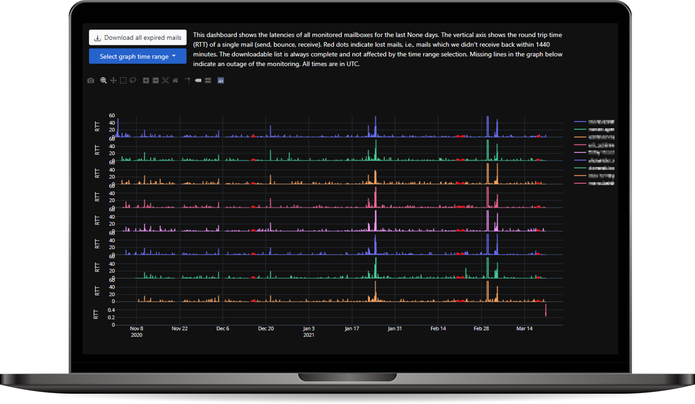

# Ping Pong Mail Monitor

[](LICENSE.txt)
[](https://hub.docker.com/r/blu3r4y/ping-pong-mail-monitor)
[](https://hub.docker.com/r/blu3r4y/ping-pong-mail-monitor)


An application that sends mails to one or more addresses and monitors if they are correctly bounced backed to another address.
Initially inspired to monitor a flaky mail server of the OEH JKU.



## Deployment

First, create two GMail accounts ("ping" & "pong").
Then, [create an API key](https://developers.google.com/gmail/api/quickstart/python) for each and store the `credentials.json` that you can download from the developer console to
  - `data/credentils.ping.json` for the account that will send mails
  - `data/credentils.pong.json` for the account that will receive mails

Next, rename the `config.template.json` to `config.json` and change the parameters accordingly.

| Configuration            | Default                 | Description |
|--------------------------|-------------------------|-------------|
| `auth_method`            | `console`               | Either `server` (opens a local web server for the initial OAuth callback - for local development) or `console` (requires console interaction - for production servers where you can not easily open sockets on the fly) |
| `pings_per_hour`         | `6`                     | Number of mails that shall be sent per target and hour (maximum: `60`) |
| `receive_timeout`        | `1440`                  | Minutes to wait for an mail to be received before it is declared as expired |
| `prefix`                 | `#PINGPONGMAILMONITOR#` | Text that is prepended to every subject line in all mails |
| `targets`                | `[]`                    | Mail addresses to which we will shall send mails |
| `default_dashboard_days` | `30`                    | The number of recent days that will be shown and cached on the dashboard |

Finally, just use the already pushed [blu3r4y/ping-pong-mail-monitor](https://hub.docker.com/r/blu3r4y/ping-pong-mail-monitor) container like so

```bash
docker run --detach \
  --name ping-pong-mail-monitor \
  --restart always \
  --volume /path/to/your/data:/usr/src/data \
  --env API_TOKEN=CHANGE-ME-TO-SOMETHING-SECRET \
  blu3r4y/ping-pong-mail-monitor
```

Alternatively, build the container yourself with `docker build -t ping-pong-mail-monitor .`

### Authentication on a Server

To complete the initial authentication flow on a server start the container once like so

```bash
sudo docker run --rm -i \
  --volume /path/to/your/data:/usr/src/data \
  blu3r4y/ping-pong-mail-monitor /bin/bash -c 'python /usr/src/app/monitor.py'
```

This will create tokens in `data/token.ping.pickle` and `data/token.pong.pickle` on success.

### Web API

To add or remove targets easily, you can access the exposed API on `http://localhost:80/api` as long as you configured the `API_TOKEN` environment variable as well.

## Attribution

Favicon made by [Freepik](https://www.flaticon.com/authors/freepik) from [Flaticon](https://www.flaticon.com/).
Laptop Mockup made by [Rawpixel](https://www.rawpixel.com/) from [Freepik](http://freepik.com/).